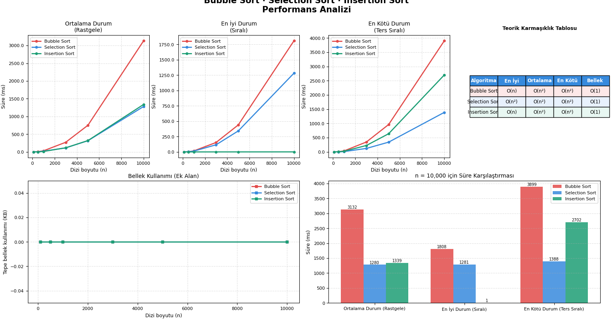

# Sorting Algorithms Performance & Memory Benchmark

Bu proje; bilgisayar bilimlerinin temel taşlarından olan **Bubble Sort**, **Selection Sort** ve **Insertion Sort** algoritmalarının performans ve bellek tüketim analizini yapan bir mühendislik çalışmasıdır. 

Teorik zaman ve alan karmaşıklığı (Big-O) değerlerinin, Python ortamında farklı veri boyutları ve senaryolar altında nasıl gerçekleştiğini deneysel verilerle ölçmeyi ve görselleştirmeyi amaçlar.

---

## 🚀 Öne Çıkan Özellikler

* **Çoklu Senaryo Analizi:** Algoritmalar; En İyi Durum (Sıralı dizi), Ortalama Durum (Rastgele dağılım) ve En Kötü Durum (Ters sıralı dizi) olmak üzere 3 farklı senaryoda test edilmektedir.
* **Hassas Zaman Ölçümü:** Python'ın `time.perf_counter()` modülü kullanılarak milisaniye (ms) düzeyinde yüksek çözünürlüklü ölçümler yapılmıştır.
* **Dinamik Bellek İzleme:** `tracemalloc` kütüphanesi entegre edilerek algoritmaların çalışma esnasında tükettiği tepe (peak) ek bellek miktarı KB cinsinden anlık olarak yakalanmıştır.
* **Kapsamlı Veri Görselleştirme:** Elde edilen tüm test sonuçları, `matplotlib` kullanılarak tek bir raporlama panosunda (Dashboard) birleştirilip otomatik olarak kaydedilir.

---

## 📊 Teorik Karmaşıklık Analizi

Projede analizi yapılan algoritmaların literatürdeki Big-O karmaşıklık tablosu aşağıdadır:

| Algoritma | En İyi Durum (Best) | Ortalama Durum (Average) | En Kötü Durum (Worst) | Ek Alan Karmaşıklığı |
| :--- | :---: | :---: | :---: | :---: |
| **Bubble Sort** | $O(n)$ | $O(n^2)$ | $O(n^2)$ | $O(1)$ |
| **Selection Sort** | $O(n^2)$ | $O(n^2)$ | $O(n^2)$ | $O(1)$ |
| **Insertion Sort** | $O(n)$ | $O(n^2)$ | $O(n^2)$ | $O(1)$ |

---

## 📈 Deneysel Bulgular ve Çıkarımlar

Kodun çalıştırılmasıyla üretilen grafikler üzerinden yapılan analizler:

1. **Insertion Sort Avantajı:** Küçük veri setlerinde ve özellikle **En İyi Durum (Sıralı)** senaryosunda Insertion Sort, iç döngüye girmeden $O(n)$ hızında çalışarak diğer algoritmalara domine etmiştir.
2. **Selection Sort Kararlılığı:** Selection Sort, dizinin başlangıç durumundan (sıralı veya ters sıralı) bağımsız olarak her zaman en küçük elemanı aradığı için 3 senaryoda da birbirine çok yakın grafikler çizmiş ve $O(n^2)$ yapısını doğrulamıştır.
3. **Bellek Tüketimi (Ek Alan):** Tüm algoritmalar *in-place* (yerinde) sıralama yaptığı için teorik ek alan karmaşıklıkları $O(1)$'dir. Deneysel ölçümlerde de veri boyutu ($n$) artsa bile tepe bellek kullanımının sabit kaldığı `tracemalloc` ile kanıtlanmıştır.

> 💡 **Not:** Proje çalıştırıldığında üretilen güncel grafik panosunu aşağıda görebilirsiniz:
> 

---

## 🛠️ Kurulum ve Çalıştırma

### 🛠️ Gereksinimler

Projenin sorunsuz çalışması için sisteminizde **Python 3.4+** sürümünün ve aşağıdaki harici grafik kütüphanesinin kurulu olması gerekmektedir:

```bash
# Grafik görselleştirme için gerekli harici kütüphane
pip install matplotlib